# Django login project using Allauth

- Go to wireframepro.mockflow.com and draw a design of what you like your frontend to look like. Here's mine.

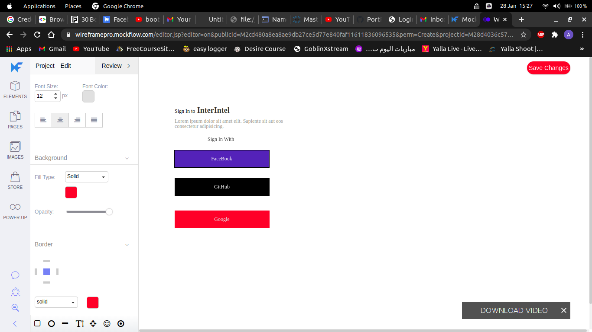

- Check if you have python3 installed in your system using the command: python --version

- Install virtualenv using the command: pip install virtualenv

- create a virtual environment using the command: virtualenv nameOfTheVenv in your prefered directory

- cd into the directory you have created the virtualenv and activate it using the command: source nameOfTheVenv/bin/activate

- Install django in the activated virtualenv using the command: pip install django

- start a new project with the virtualenv activated using the command: django-admin startproject NameOfProject

- cd into the project and start one app with the command: python manage.py startapp NameOfYourApp

- go to settings.py and add the app into installed apps as shown below

            INSTALLED_APPS = [
                    # defaultApps
                    .....
                     # MyApps
                    'NameOfYourApp',
            ]

# Using django-allauth

Django-allauth is an Integrated set of Django applications addressing authentication, registration, account management as well as 3rd party (social) account authentication.

For this task we are going to use the social account authentication. Social authentication
is always convenient to users because the dont have to memorize the password to their many accounts on different platforms.

- Install allauth using the command: pip install django-allauth

* Go to settings.py and add 'django.contrib.sites' to INSTALLED_APPS and also add allauth as shown below:

            AUTHENTICATION_BACKENDS = [
                    ...
                    #Needed to login by username in Django admin, regardless of `allauth`
                    'django.contrib.auth.backends.ModelBackend',

                    #`allauth` specific authentication methods, such as login by e-mail
                    'allauth.account.auth_backends.AuthenticationBackend',
                    ...
                ]

            INSTALLED_APPS = [
                            ...
                      # The following apps are required:

                        'allauth',
                        'allauth.account',
                        'allauth.socialaccount',
                        'allauth.socialaccount.providers.google',
                        'allauth.socialaccount.providers.facebook',
                        'allauth.socialaccount.providers.github',

        #here we've added google,facebook, and github as our social authenticators

* add a SITE_ID in settings.py like this
  SITE_ID = 1

* Go to urls.py and and this to urlpatterns:

                        urlpatterns = [
                            ...
                            path('accounts/', include('allauth.urls')),
                            ...
                        ]

* Go to the App you created and make a folder called templates. Inside this folder create another folder with the name same as the app. In the second folder create a file called home.html or your preferred name.
  write the following code inside there. You can style it as you want.

                      
              <h3>Welcome to InterIntel</h3>
              
You're logged in as , {{ user.username }} !

              
              <h5>Register/login below</h5>
              <a href=""
              ><button type="button" class="btn btn-danger mx-5 mb-3">
                  <i class="fa fa-google"></i>
                  Login with Google
              </button></a
              > 
              <a href="">
              <button type="button" class="btn btn-dark mx-5 mb-3">
              <i class="fa fa-github"></i> Login with Github
              </button>
                  </a>
               
              <a href="">
              <button type="button" class="btn btn-primary mx-5">
                  <i class="fa fa-facebook"></i> Login with facebook
              </button>
              </a>

                  

* Then go to urls.py and tell it to point to this file as follows:

            from django.contrib import admin
            from django.urls import path, include
            from django.views.generic import TemplateView #this is for class based views
            from django.conf import settings #settings for static files
            from django.conf.urls.static import static # for static files

            urlpatterns = [
                path('', TemplateView.as_view(template_name='login/home.html')),
                path('admin/', admin.site.urls),
                path('accounts/', include('allauth.urls')),

            ] + static(settings.STATIC_URL, document_root=settings.STATIC_ROOT) # loading static files

* This is how my app looks after styling:
  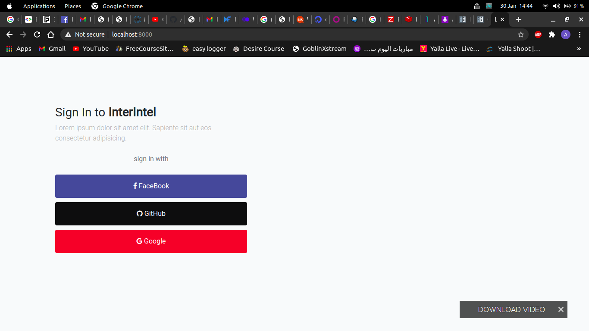

* Now run this command to make the migrations: python manage.py migrate
  Then create an admin using the command: python manage.py createsuperuser
  Run the server using the command: python manage.py runserver and go to http://localhost:8000/admin/

* Add a Site for your domain, matching settings.SITE_ID (django.contrib.sites app) as shown below:

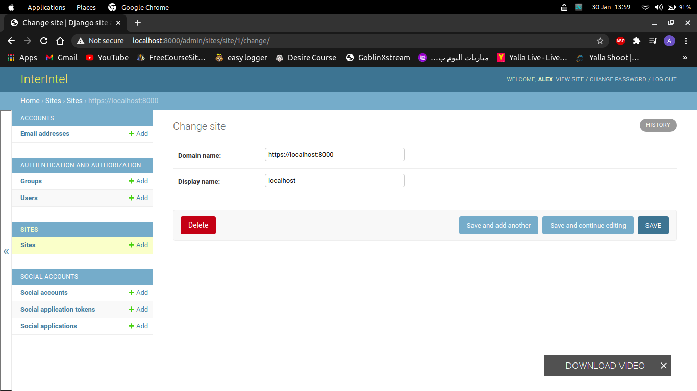

- Go to https://console.developers.google.com/ to create a OAuth app. and input the details Name, URIs, and
  Authorized URIs as shown below:

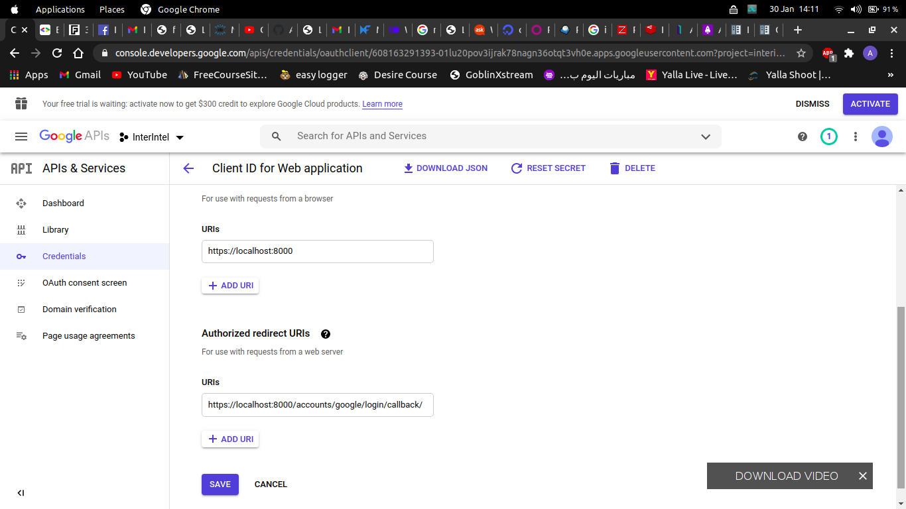

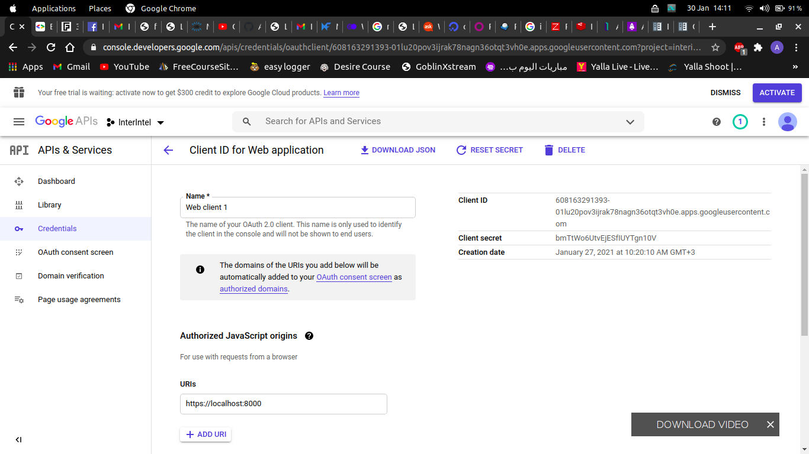

- For github log into your account then go to settings then developer settings. create a OAuth app and get the details as shown below:

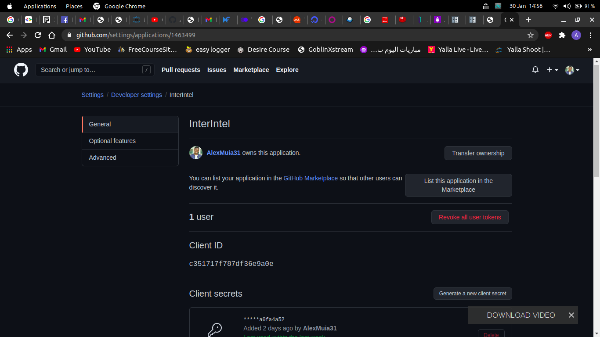

- for facebook head to https://developers.facebook.com/ and get the details as shown below:

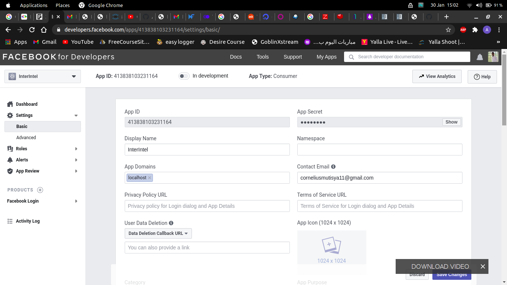

- In all apps the callback should be:
  https://localhost/accounts/google/login/callback
  https://localhost/accounts/github/login/callback
  https://localhost/accounts/facebook/login/callback

- the URIs should be:
  https://localhost:8000

* Take the Client ID and the secret key the head to the admin dashboard and add the a social application as shown below:

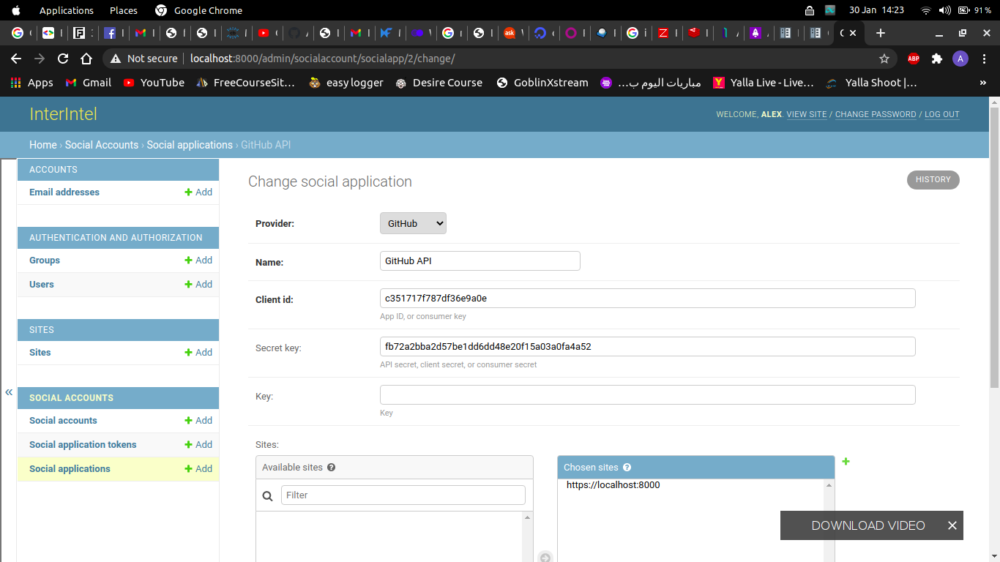

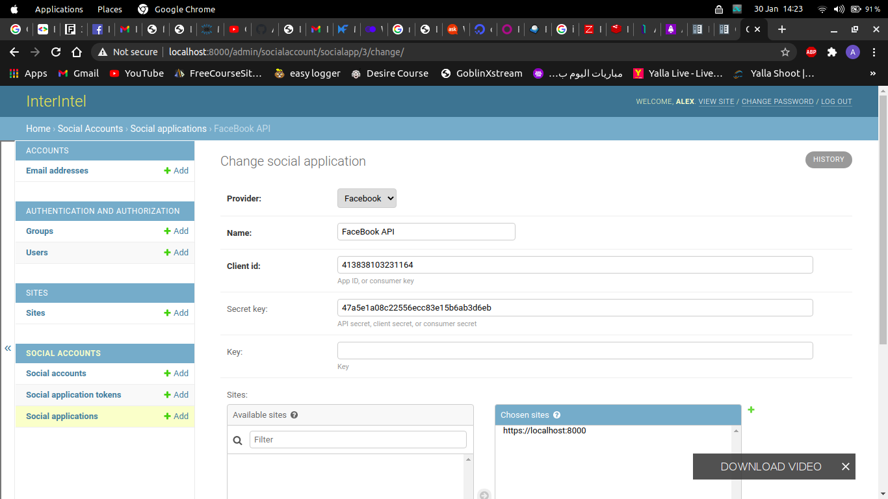

- facebook wont work without ssl . To set it up you need to install the following packages:

                pip install django-extensions
                pip install Werkzeug
                pip install pyOpenSSL

                then add 'django-extensions' to your INSTALLED_APPS

* now run the server using the following command:

         python manage.py runserver_plus --cert-file /tmp/cert

* Go to your app and you'll be able to log in with the social apps. Here's how mine looks like:

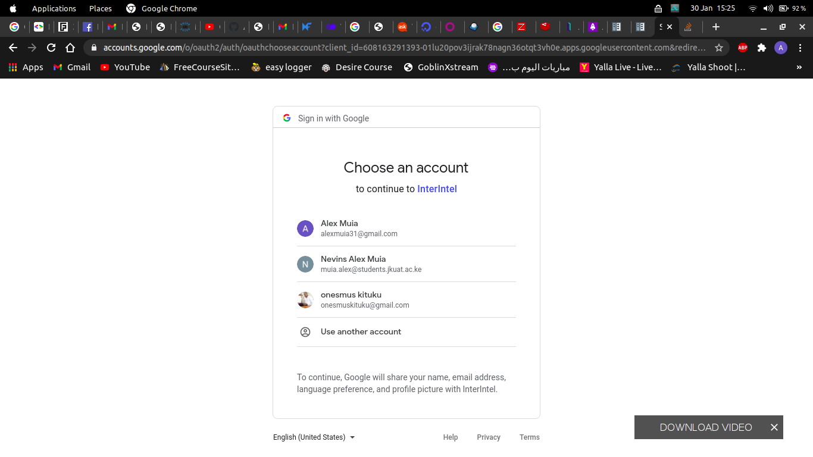

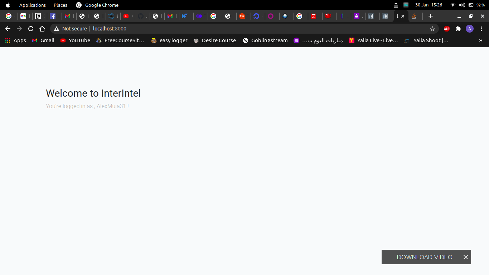
